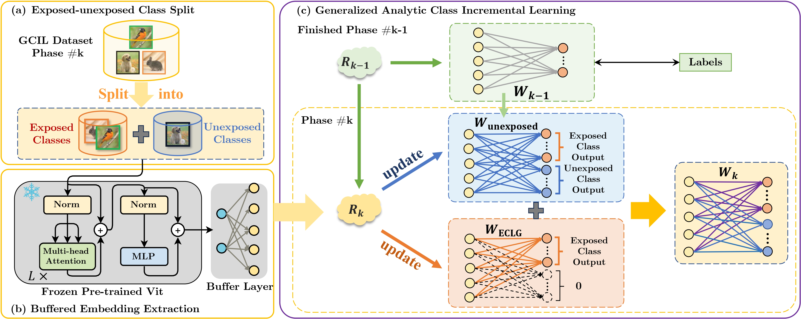

<div align="center">
  
# 【NeurIPS'2024】GACL: Exemplar-Free Generalized Analytic Continual Learning
[](https://neurips.cc/)
</div>


The code repository for "GACL: Exemplar-Free Generalized Analytic Continual Learning" [[paper](https://neurips.cc/virtual/2024/poster/95330)] in PyTorch. The implementation of the GACL algorithm is also available at [Analytic-Continual-Learning](https://github.com/ZHUANGHP/Analytic-continual-learning).

---

## 📌 Citation
If you find this paper useful, please consider staring 🌟 this repo and citing 📑 our paper:
```bib
@InProceedings{GACL_Zhuang_NeurIPS2024,
    title     = {{GACL}: Exemplar-Free Generalized Analytic Continual Learning},
    author    = {Huiping Zhuang and Yizhu Chen and Di Fang and Run He and Kai Tong and Hongxin Wei and Ziqian Zeng and Cen Chen},
    year      = {2024},
    booktitle = {Advances in Neural Information Processing Systems},
    publisher = {Curran Associates, Inc.}
}
```

## 📖 Introduction

We propose a new exemplar-free Generalized class incremental learning (GCIL) technique named GACL. The GACL adopts analytic learning (a gradient-free training technique) and delivers an analytical  (i.e., closed-form) solution to the GCIL scenario. This solution is derived via decomposing the incoming data into exposed and unexposed classes, thereby attaining **a weight-invariant property**, a rare yet valuable property supporting **an equivalence between incremental learning and its joint training**. Such an equivalence is crucial in GCIL settings as data distributions among different tasks no longer pose challenges adopting our GACL. Theoretically, this equivalence property is validated through matrix analysis tools. 

## 📚 Method

<div align="center">

</div>


## ⚡ Quick Start

### Setup code environment

* Python 3.10, PyTorch 1.13

* More detail (See [environment.yaml](environment.yaml))

A suitable [conda](https://conda.io/) environment named `gacl` can be created and activated with:
```Bash
   conda env create -f environment.yaml
   conda activate gacl
```

### Datasets

We provide the source code on three benchmark datasets, i.e., CIFAR-100, ImageNet-R and Tiny-ImageNet. 

### Download the Pre-trained Model

For all experiments in the paper, we use a deit vit backbone pre-trained on 611 ImageNet classes after excluding 389 classes that overlap with CIFAR and Tiny-ImageNet to prevent data leakage.

Please download the pre-trained deit vit network provided by [Learnability and Algorithm for Continual Learning](https://github.com/k-gyuhak/CLOOD.git) from

https://drive.google.com/file/d/1uEpqe6xo--8jdpOgR_YX3JqTHqj34oX6/view?usp=sharing

 and save the file as ./models/best_checkpoint.pth

### Training scripts

Please see `scripts` folder.

The current implementation of GACL does not support multi-GPU training. However, we will soon provide a version with Distributed Data Parallel (DDP) support.

```Bash
   . scripts/gacl.sh
```

### GCIL Setting

It is possible to modify the the disjoint class ratio $r_\text{D}$ (N) and blurry sample ratio $r_\text{B}$ (M) in the scripts for various data distribution. 

## 🎗️ Acknowledgments

This code implementation are adopted from [Si-Blurry](https://github.com/KHU-AGI/Si-Blurry). We sincerely appreciate for their contributions.

## 📝 License

This project is licensed under <a rel="license" href="https://github.com/sczhou/CodeFormer/blob/master/LICENSE">GPL-3.0 license</a>. Redistribution and use should follow this license.
