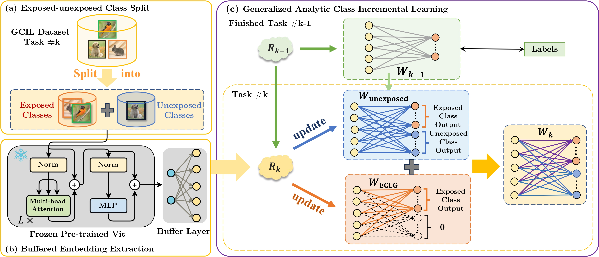

<div align="center">
  
# 【NeurIPS'2024】GACL: Exemplar-Free Generalized Analytic Continual Learning
### Huiping Zhuang*, Yizhu Chen*, Di Fang, Run He, Kai Tong, Hongxin Wei, Ziqian Zeng†, Cen Chen†
  
[](https://neurips.cc/)
[](https://arxiv.org/abs/2403.15706)
</div>

The code repository for [GACL: Exemplar-Free Generalized Analytic Continual Learning](https://arxiv.org/pdf/2403.15706) in PyTorch. The implementation of the GACL algorithm is also available at [Analytic-Continual-Learning](https://github.com/ZHUANGHP/Analytic-continual-learning).

---

## 📌 Citation
If you find this paper useful, please consider staring 🌟 this repo and citing 📑 our paper:
```bib
@InProceedings{GACL_Zhuang_NeurIPS2024,
    title     = {{GACL}: Exemplar-Free Generalized Analytic Continual Learning},
    author    = {Huiping Zhuang and Yizhu Chen and Di Fang and Run He and Kai Tong and Hongxin Wei and Ziqian Zeng and Cen Chen},
    year      = {2024},
    booktitle = {Advances in Neural Information Processing Systems},
    publisher = {Curran Associates, Inc.}
}
```

## 📖 Introduction

We propose a new exemplar-free Generalized class incremental learning (GCIL) technique named GACL. The GACL adopts analytic learning (a gradient-free training technique) and delivers an analytical  (i.e., closed-form) solution to the GCIL scenario. This solution is derived via decomposing the incoming data into exposed and unexposed classes, thereby attaining **a weight-invariant property**, a rare yet valuable property supporting **an equivalence between incremental learning and its joint training**. Such an equivalence is crucial in GCIL settings as data distributions among different tasks no longer pose challenges adopting our GACL. Theoretically, this equivalence property is validated through matrix analysis tools. 

## 📚 Method

<div align="center">

</div>

## ⚡ Quick Start

### Setup code environment

* Python 3.10, PyTorch 1.13

* More detail (See [environment.yaml](environment.yaml))

A suitable [conda](https://conda.io/) environment named `gacl` can be created and activated with:
```Bash
   conda env create -f environment.yaml
   conda activate gacl
```

### Datasets

We provide the source code on three benchmark datasets, i.e., CIFAR-100, ImageNet-R and Tiny-ImageNet. 

### Download the Pre-trained Model

For all experiments in the paper, we use a deit vit backbone pre-trained on 611 ImageNet classes after excluding 389 classes that overlap with CIFAR and Tiny-ImageNet to prevent data leakage.

Please download the pre-trained deit vit network provided by [Learnability and Algorithm for Continual Learning](https://github.com/k-gyuhak/CLOOD.git) from

https://drive.google.com/file/d/1uEpqe6xo--8jdpOgR_YX3JqTHqj34oX6/view?usp=sharing

 and save the file as ./models/best_checkpoint.pth

### Training scripts

Please see `scripts` folder.
For example, you may run GCIL experiments using our GACL method by

```Bash
   . scripts/gacl.sh
```
You may change various arguments for different experiments.
- `NOTE`: Short description of the experiment. Experiment result and log will be saved at `results/DATASET/NOTE`.
  - WARNING: logs/results with the same dataset and note will be overwritten!
- `MODE`: Method to be applied. Methods implemented in this version are: [er, ewc++, rm, mvp-r, dualpormpt, l2p, lwf, mvp, slda, gacl]
- `DATASET`: Dataset to use in experiment. Supported datasets are: [cifar100, tinyimagenet, imagenet-r]
- `N_TASKS`: Number of tasks.
- `N`: The disjoint class ratio $r_\text{D}$ in Si-Blurry split. N=100 for full disjoint, N=0 for full blurry.
- `M`: The blurry sample ratio $r_\text{B}$ in Si-Blurry split.
- `GPU_TRANSFORM`: Perform AutoAug on GPU, for faster running.
- `USE_AMP`: Use automatic mixed precision (amp), for faster running and reducing memory cost.
- `MEM_SIZE`: Maximum number of samples in the episodic memory.
- `ONLINE_ITER`: Number of model updates per sample.
- `EVAL_PERIOD`: Period of evaluation queries, for calculating $ \mathcal A_{\text{AUC}}$ .


### Hyper-Parameters of the GACL
The backbones are frozen during the incremental learning process of our GACL.

1. **Buffer Size**

    For the GACL, the buffer size means the *expansion size* of the random projection layer. On most datasets, the performance of the algorithm first increases and then decreases as the buffer size increases. You can see further experiments on this hyperparameter in our papers. A larger buffer size requires more memory.

2. **$\gamma$ (Regularization Term)** 

    For the dataset used in the papers, $\gamma$ is insensitive within a interval. However, a $\gamma$ that is too small may cause numerical stability problems in matrix inversion, and a $\gamma$ that is too large may cause under-fitting of the classifier. When you migrate our algorithm to other datasets, we still recommend that you do some experiments to check whether $\gamma$ is appropriate.

## 🎗️ Acknowledgments

This code implementation are adopted from [Si-Blurry](https://github.com/KHU-AGI/Si-Blurry). We sincerely appreciate for their contributions.

## 📝 License

This project is licensed under <a rel="license" href="https://github.com/CHEN-YIZHU/GACL/blob/main/LICENSE">GPL-3.0 license</a>. Redistribution and use should follow this license.
